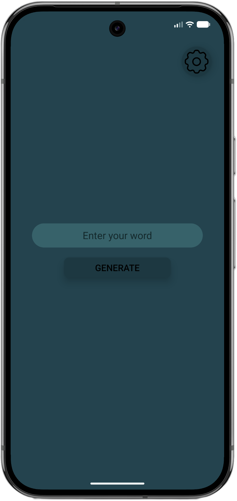
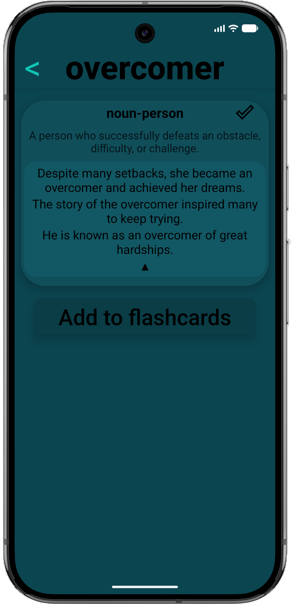
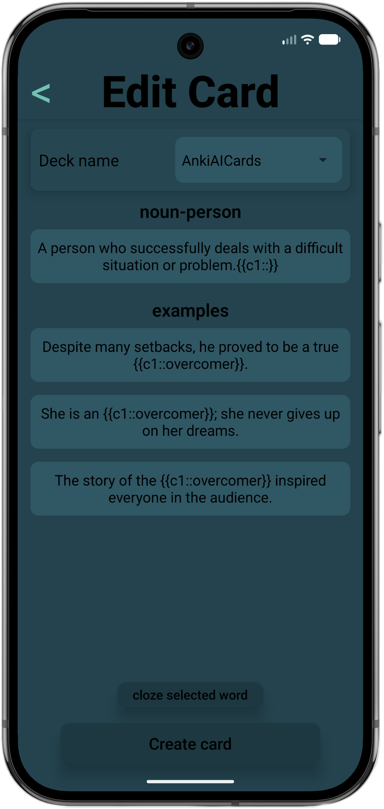
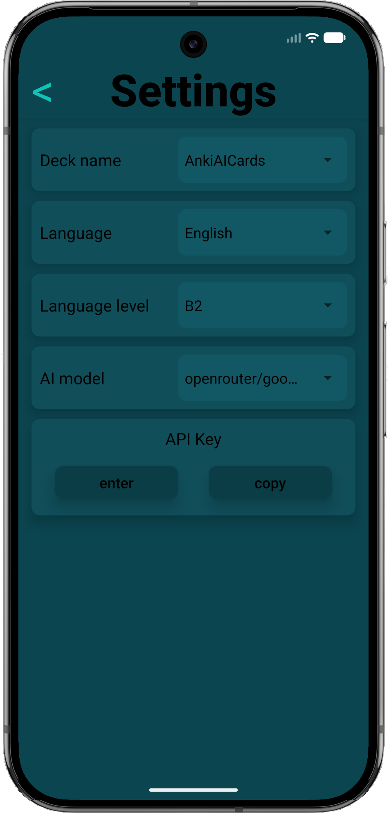
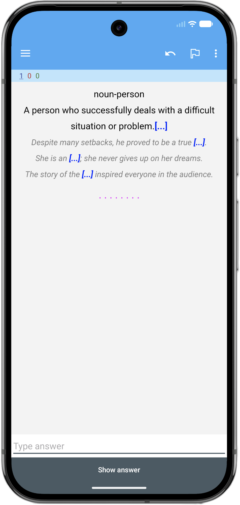

# AnkiAI-Cards


AnkiAI-Cards is a React Native mobile app for Android that helps you build vocabulary flashcards effortlessly using AI. Enter any word and the app will generate structured definitions, parts of speech, and usage examples via your chosen AI provider. You then review the results, pick which entries to turn into cards, optionally apply cloze deletions, and send them directly into your AnkiDroid deck — all without leaving the app.
<br>
<br>

---

## Features

### 🏠 Home Screen — Word Input

Type a word and tap **GENERATE**. The app calls your selected AI model and fetches structured linguistic data in seconds.



---

### 📋 Result Screen — Review & Select

The AI response is presented as a list of cards grouped by part of speech. Each card shows the definition and can be expanded to reveal usage examples. Tap a card to select it for export.



---

### ✏️ Card Editor — Edit & Apply Cloze

Before creating a card you can freely edit the definition and example sentences. Select any word or phrase in the text and tap **"Cloze selected word"** to wrap it in an Anki cloze deletion (`{{c1::...}}`). Step through multiple selected entries one by one.



---

### ⚙️ Settings — Customise Generation

Configure everything that drives the AI prompt:

| Setting            | Description                                    |
| ------------------ | ---------------------------------------------- |
| **Deck name**      | Target AnkiDroid deck for new cards            |
| **Language**       | Language of the word being looked up           |
| **Language level** | CEFR level (A1 → C2) for example complexity    |
| **AI model**       | Google Gemini, OpenAI, or any OpenRouter model |
| **API key**        | Stored securely on-device                      |

You can enter a unique option! For example - create **English-drank-pirate** into **Language** configuration.



---

### 🤖 Multi-Provider AI Support

The app supports three AI backends out of the box:

- **Google Gemini** — via `@google/genai` SDK
- **OpenAI** — via the official `openai` SDK
- **OpenRouter** — via `openai` as weel, access hundreds of models with a single API key

---

### 🃏 Direct AnkiDroid Integration

Generated cards are added to AnkiDroid using the AnkiDroid API. The card model includes a keyword, definition (with cloze), and example sentences. No manual import required.



---

## Getting Started

### Prerequisites

- Node.js ≥ 18
- JDK 17
- Android SDK (API 28+)
- AnkiDroid installed on the target device/emulator
- An API key for Gemini, OpenAI, or OpenRouter

### Clone the repository

```bash
git clone https://github.com/Deal-overcomer/AnkiAI-Cards.git
cd AnkiAI-Cards
```

### Install dependencies

**terminal**

```bash
# using npm
npm install

# or yarn
yarn
```

### Run metro and android simulator

**terminal**

```bash
# using npm
npm run android

# or yarn
yarn android
```

### Build a release APK for Android

**terminal**

```bash
cd android
./gradlew assembleRelease
```

The output APK will be located at:

```
android/app/build/outputs/apk/release/app-release.apk
```

> **Note:** Make sure you have a signing keystore configured in `android/app/build.gradle` before building a release APK intended for distribution. Set your environments in `android/gradle.properties` as well.

---

## Downloads

Pre-built Android APKs are available on the [Releases](https://github.com/Deal-overcomer/AnkiAI-Cards/releases) page.
